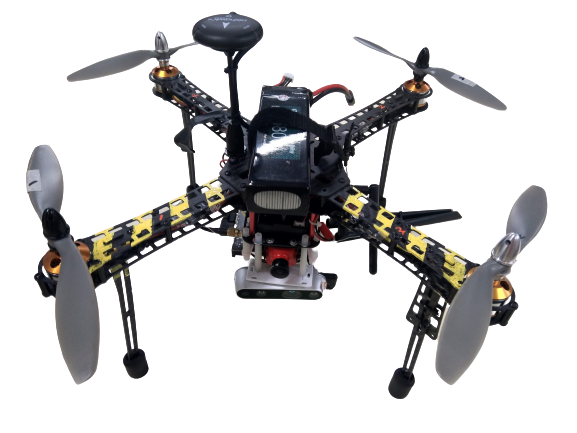

Outline

- 無人機基礎教學
  - 組成元件與功能
  - 操控方式
  - 飛行安全
  - PID control
  - 
- PION-1介紹
- Ardupilot教學
  - 數據分析
  - Ardupilot EKF
  - Ardupilot vision
- Navigation
  - 巡航介紹與問題定義
  - 巡航原理教學
  - SLAM教學
  - ROS教學
  - Cartographer教學
  - 串接ROS與Ardupilot
- Simulation
  - Gazebo教學

- Raspberry pi 教學